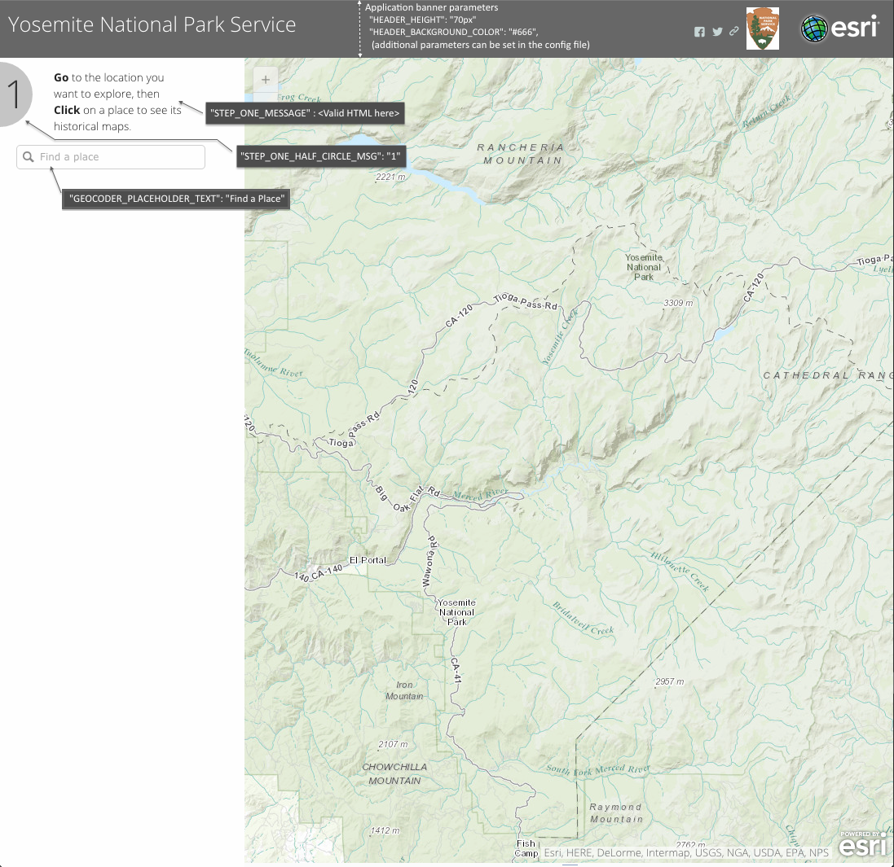
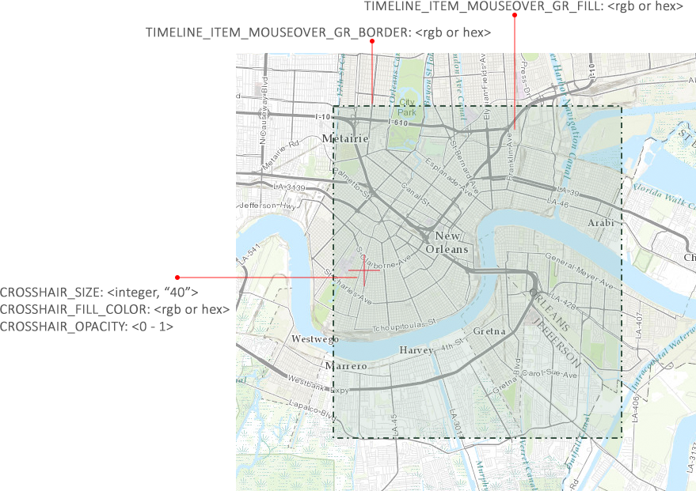
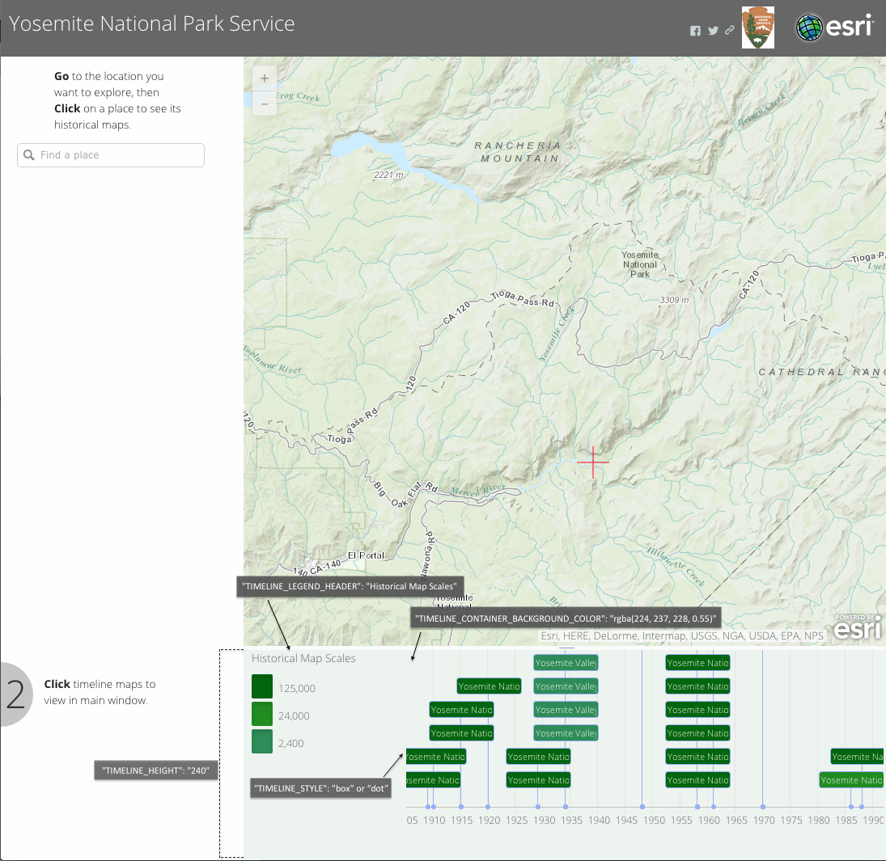
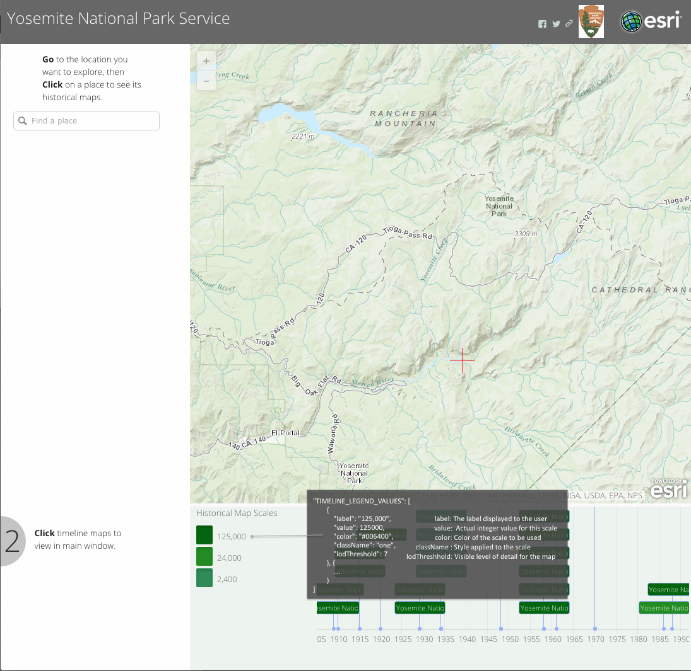
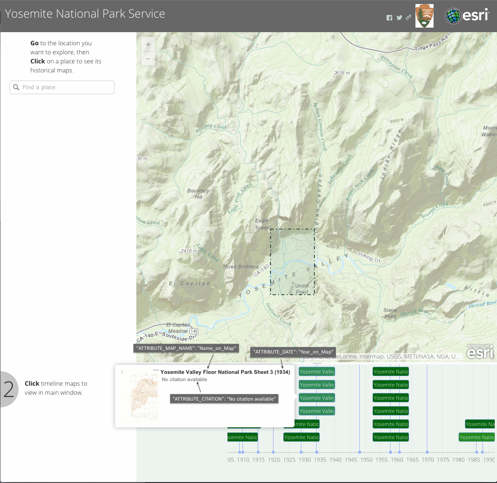

## Browser Support

| </br>IE 11 / Edge | </br>Firefox | </br>Chrome | </br>Safari |
| -------------- | ------------- | ------------- | ------------- |
|IE11, Edge|last 2 versions|last 2 versions|last 2 versions|


#### Features
*	Save web map to your ArcGIS Online account
*	Panning and zooming the timeline
*	Filtering maps based on scale
*	Re-ordering selected maps by drag and drop
*	Modifying the opacity of a map
*	Customizing the application's user interface (for example, colors and text)
*	Using your ArcGIS Online webmap in the template.
*	Sharing the application's state (that is, the current view) with other users
*	Capturing the URL parameters and using them in your application
*	Enabling your application to sign in to ArcGIS Online using [OAuth 2.0](http://oauth.net/2/)

##### Demo - USGS Historical Topographic Map Explorer

[Demo]

#### Instructions

1. Download and unzip the [Zip] file or clone the repository into a folder on a web server.
2. Web-enable the directory.
3. In the config folder, open the config.js file in a text editor.
4. Edit the config.js file to include information about your image service, as described below.
4. View the changes by opening the index.html file in a web browser.

You can configure the appearance of many of the application's components (for example, the title, header, sidebar, map, and timeline).``

The names of the components (that is, parameters) are in quotations and the parameter values are in brackets. Comments are preceded by a forward slash (/). To change the appearance of a component, edit the parameter value.
For example, to change the application's title, header height, and header background color, you would change the APP_TITLE, HEADER_HEIGHT, AND HEADER_BACKGROUND_COLOR parameters shown below.

```sh
"APP_TITLE": "USGS Historical Topographic Map Explorer"
// Header height
"HEADER_HEIGHT": "70px"
// Header/Banner background color (rgb or hex)
"HEADER_BACKGROUND_COLOR": "#333"
```

##### Component: Application title
This is the text that is displayed at the top of the application window.
Parameter: APP_TITLE; Example value: “USGS Historical Topographic Map Explorer”

##### Component: Application header
You can change the appearance of the application's header by modifying parameters associated with the color, text, and size of this component.

| Parameter |  Value  | Description
| ------------ | ------------ | ------------ |
| `HEADER_HEIGHT` | 70px  | The height of the header box
| `HEADER_BACKGROUND_COLOR`  | rgb(48, 75, 60) or hex value  | The definition of the color inside the header box. It can be specified as either a Red, Green Blue (r,g,b) or hexidecimal (hex) color  |
| `HEADER_TEXT_COLOR`  | white  | The color of the header text inside the header box.  |
| `HEADER_TEXT_SIZE`  | 1.6em  | this is the size of the header text in the header box. It should be specified in em size units, which is recommended by the W3C. The em text size can be converted from pixels using this formula: pixels/16=em . So, the default text size of browsers of 16 pixels is 1em.  |
| `HEADER_TEXT`  | USGS Historical Topographic Map Explorer  |  this is the text string for the header in the header box. |
| `SUBHEADER_TEXT_COLOR`  | 0.9em | this is the size of the subheader text in the header box  |

Additionally, you can configure parameters related to setting up queries, which are used to find the scanned map images that the user is interested in seeing:

| Parameter  | Value  | Description  |
| ------------ | ------------ | ------------ |
| `IMAGE_SERVER`  | image service url  | Enter a valid Image Service URL to an ArcGIS REST Services Directory  |
| INFO_THUMBNAIL  | /info/thumbnail  | Enter a relative path to thumbnails on Image Service (this will be a child resource to the Image Service you listed above  |
| OUTFIELDS  | ['*']  |  outfields (return all the fields for now) |
|  IMAGE_SERVER_WHERE | OBJECTID =  | The OBJECTID is used in the query |
| QUERY_WHERE  |  "isDefault = 1"|  A where clause for the query. |

###### Application header and sidebar
You can style the application's header, text, and styles under the section "User Interface styles can be set below this point" in the config [file](config/defaults.js?raw=true)
Below are some of the parameters used to style the application's header and "Step 1" text.


###### Map crosshair and mouse over/out style
These parameters style the crosshair and polygons displayed on a map when a user either selects a point on the map or hovers the mouse over an item in the timeline.

```sh
// Crosshair style
"CROSSHAIR_SIZE": 40,
"CROSSHAIR_FILL_COLOR": [255, 0, 24]
"CROSSHAIR_OPACITY": 0.95
// Timeline item mouseover graphics
"TIMELINE_ITEM_MOUSEOVER_GR_FILL": [146, 179, 160, 0.10]
"TIMELINE_ITEM_MOUSEOVER_GR_BORDER": [48, 75, 60, 1.0]
// Sidebar item mouseover graphics
"SIDEBAR_MAP_MOUSEOVER_GR_FILL": [146, 179, 160, 0.0]
"SIDEBAR_MAP_MOUSEOVER_GR_BORDER": [48, 75, 60, 1.75]
"IMAGE_BORDER_WIDTH": 1.75
```

###### Timeline
Timeline parameters control the timeline container and the timeline.  For instance, indicating initial height of the timeline, and the start and end dates of the timeline.


```sh
// Specifies the style for the timeline events. Choose from "dot" or "box". Values below are used in the demo applications.
"TIMELINE_STYLE": "box",
// Timeline height (in pixels)
"TIMELINE_HEIGHT": "240",
// Minimum zoom interval for the visible range (milliseconds). It will not be possible to zoom in further than this minimum.
"TIMELINE_ZOOM_MIN": 201536000000,
// Maximum zoom interval for the visible range (milliseconds). It will not be possible to zoom out further than this maximum.
"TIMELINE_ZOOM_MAX": 4153600000000,
// If true, timeline events will be clustered together when zooming out.
"TIMELINE_CLUSTER": false,
// Enable a navigation menu with buttons to move and zoom the timeline.
"TIMELINE_SHOW_NAVIGATION": false,
// Set a minimum Date for the visible range. It will not be possible for the user to drag the timeline beyond this minimum
"TIMELINE_MIN_DATE": '1950',
// Set a maximum Date for the visible range. It will not be possible to move beyond this maximum.
"TIMELINE_MAX_DATE": '2015',
// steps (number of x-value ticks) between labels
"TIMELINE_STEP": 5,
// When true, events are moved/animated when resizing or moving them. This is very pleasing for the eye, but does require more computational power.
"TIMELINE_ANIMATE": true,
// Timeline scale (Available scales: millisecond, second, minute, hour, weekday, day, month, year)
"TIMELINE_SCALE": "year",
```

###### Timeline Legend
The timeline legend displays the different map scales for your maps.  The legend is interactive.  Users can filter items in the legend by selecting one or more items in the legend to hide.


Below are the properties for a single scale.  The USGS demo uses 5 scales and the Yosemite demo uses 3 scales.

```sh
"TIMELINE_LEGEND_VALUES": [{
    "label" : <a string representing a single scale in the legend>,
    "value" : <a integer value representing a single scale>,
    "color" : <the color used in the legend for a single scale>,
    "className" : <the CSS style used for a single scale>,
    "lodThreshold" : <the level of detail for a single scale>
}]
```

The string representing the CSS style used for a single scale must be indicated in the timelineItem.css file:
```sh
div.timeline-event-box.five {
	background-color: #004ED7;
	color: #f9f9f9;
}
```

###### Timeline item/map tooltip
Tooltips are displayed when users hover over a single item in the timeline.  The tooltip can display the map's title, thumbnail, date, and any additional content.

<br />
Below are the field names used in the Yosemite <a href="http://chrismahlke.github.io/map-collection-explorer/" target="_blank">demo</a> application.
```sh
// THESE MUST MATCH the attribute field names in the feature/map service attribute table
"ATTRIBUTE_OBJECTID": "OBJECTID"
// Name of map displayed in the tooltip and timeline item(s)
"ATTRIBUTE_MAP_NAME": "Name_on_Map"
// Date field
"ATTRIBUTE_DATE": "Year_on_Map"
// Scale field
"ATTRIBUTE_SCALE": "Map_Scale"
// Map citation <String> or <attribute field in the feature service>
"ATTRIBUTE_CITATION": "No citation available"
```

#### Folders and Files

The template consists of the following folders and files:

**/css/:** Styles

*	**main.css** Application styles

**/images/**: Contains images used by the application.

**/js/**: JavaScript files

*	config.js
*	main.js

**/html/**: HTML files

**index.html**: The default html file for the application.

#### Issues

Find a bug or want to request a new feature?  Please let us know by submitting an issue.

#### Contributing

Esri welcomes contributions from anyone and everyone. Please see our [guidelines for contributing](https://github.com/esri/contributing).

#### Licensing
Copyright 2019 Esri

Licensed under the Apache License, Version 2.0 (the "License");
you may not use this file except in compliance with the License.
You may obtain a copy of the License at

   http://www.apache.org/licenses/LICENSE-2.0

Unless required by applicable law or agreed to in writing, software
distributed under the License is distributed on an "AS IS" BASIS,
WITHOUT WARRANTIES OR CONDITIONS OF ANY KIND, either express or implied.
See the License for the specific language governing permissions and
limitations under the License.

A copy of the license is available in the repository's [license.txt](LICENSE?raw=true) file.

[](Esri Tags: ArcGIS ArcGIS Online Web Application boilerplate template widget dijit Esri JavaScript application USGS Landsat ArcGIS ImageServer)
[](Esri Language: JavaScript)

[//]: # (These are reference links used in the body of this note and get stripped out when the markdown processor does its job. There is no need to format nicely because it shouldn't be seen. Thanks SO - http://stackoverflow.com/questions/4823468/store-comments-in-markdown-syntax)

[Description]: <http://www.esri.com/esri-news/releases/14-3qtr/new-york-to-la-history-of-americas-maps-in-one-app>
[Demo]: <https://livingatlas.arcgis.com/topoexplorer/index.html>
[Zip]:<https://github.com/Esri/map-collection-explorer/archive/master.zip>