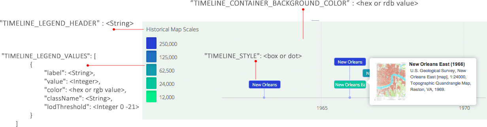

### Map Collection Explorer template

<a href="http://www.esri.com/esri-news/releases/14-3qtr/new-york-to-la-history-of-americas-maps-in-one-app" target="_blank">Description</a>

#### Features
*	Panning and zooming the timeline
*	Filtering maps based on scale
*	Re-ordering selected maps by drag and drop
*	Modifying the opacity of a map
*	Customizing the application's user interface (color, text, etc...)
*	Using your ArcGIS Online webmap to power the template.
*	Sharing the application's state with other users
*	Capturing URL parameters and using them in your application
*	Enabling your application to sign-in to ArcGIS Online using [OAuth 2.0](http://oauth.net/2/)

#### Demos

##### USGS Historical Topographic Map Explorer
<a href="http://historicalmaps.arcgis.com/usgs/" target="_blank">Production</a>
<br />

##### Yosemite National Park Map Collection
<a href="http://chrismahlke.github.io/map-collection-explorer/" target="_blank">Production</a>
<br />

#### Instructions

1. Download and unzip the .zip file or clone the repository.
2. Web-enable the directory.
3. Access the .html page.
4. Configure the parameters in the config [file](config/defaults.js?raw=true).
5. View more detailed configuration instructions [here](explorer_documentation.pdf?raw=true)

The configuration options are listed below for each component of the application (header, sidebar, map, timeline). The parameter name is in quotations and the parameter's argument is in brackets.
<br />
<br />
For example, to change the header title and color:
<br />
```sh
"APP_HEADER_TEXT" : "This is my title",
"APP_HEADER_TEXT_COLOR" : "#CCC"
```
<br />
Another important configuration parameter is the url to the ArcGIS Image Service:
<br />
```sh
"IMAGE_SERVER": "<image service url>"
```
<br />
A downloadable version of this document can be found [here](explorer_documentation.pdf?raw=true).
<br />
<br />
###### Application header

<br />
<br />
<br />
###### Application sidebar

<br />
<br />
<br />
###### Map

<br />
<br />
<br />
###### Timeline
<br />
```sh
// Specifies the style for the timeline events. Choose from "dot" or "box". Values below are used in the USGS application.
"TIMELINE_STYLE": "box",
// Timeline height
"TIMELINE_HEIGHT": "240",
// Minimum zoom interval for the visible range (milliseconds). It will not be possible to zoom in further than this minimum.
"TIMELINE_ZOOM_MIN": 201536000000,
// Maximum zoom interval for the visible range (milliseconds). It will not be possible to zoom out further than this maximum.
"TIMELINE_ZOOM_MAX": 4153600000000,
// If true, timeline events will be clustered together when zooming out.
"TIMELINE_CLUSTER": false,
// Enable a navigation menu with buttons to move and zoom the timeline.
"TIMELINE_SHOW_NAVIGATION": false,
// Initial visible start date of timeline
"TIMELINE_MIN_DATE": '1950',
// Initial visible end date of timeline
"TIMELINE_MAX_DATE": '2015',
// steps (number of x-value ticks) between labels
"TIMELINE_STEP": 5,
// When true, events are moved/animated when resizing or moving them. This is very pleasing for the eye, but does require more computational power.
"TIMELINE_ANIMATE": true,
// Timeline scale (Available scales: millisecond, second, minute, hour, weekday, day, month, year)
"TIMELINE_SCALE": "year",
```
<br />
<br />
###### Timeline Legend

<br />
```sh
"TIMELINE_LEGEND_VALUES": [{
    "label" : <a string representing a single scale in the legend>,
    "value" : <a integer value representing a single scale>,
    "color" : <the color used in the legend for a single scale>,
    "className" : <the CSS style used for a single scale>,
    "lodThreshold" : <the level of detail for a single scale>
}]
```
<br />

The string representing the CSS style used for a single scale must be indicated in the time timelineItem.css file:
```sh
div.timeline-event-box.five {
	background-color: #004ED7;
	color: #f9f9f9;
}
```
<br />
Sample
```sh
"TIMELINE_LEGEND_VALUES": [{
    "label" : "250,000",
    "value" : 250000,
    "color" : "#004ED7",
    "className" : "five",
    "lodThreshold" : 7
}]
```
<br />
<br />

Review the following ArcGIS.com help topics for details on Templates:

*	[Writing your first application](https://developers.arcgis.com/en/javascript/jstutorials/intro_firstmap_amd.html)
*   [About web application templates](http://resources.arcgis.com/en/help/arcgisonline/#/*   About_web_application_templates/010q000000nt000000/)
*   [Creating web application templates](http://resources.arcgis.com/en/help/arcgisonline/#/Creating_web_application_templates/010q00000072000000)
*   [Adding configurable parameters to templates](http://resources.arcgis.com/en/help/arcgisonline/#/Adding_configurable_parameters_to_templates/010q000000ns000000/)

#### Folders and Files

The template consists of the following folders and files:

**/config/:** A folder for your application's configuration files.

*   **defaults.js:** Define the default configuration information for the template. You can use this file to specify a default web map id, the ArcGIS Image Server REST endpoint URL, and user interface settings, for example.
*	**config.css** Contains the styles used for items on the timeline.

**/css/:** Styles.

*	**grid.css** Contains the styles used to display the list of selected historical maps.
*	**main.css** Map styles that set the margin, padding and initial height (100%).
*	**slider.css** Styles that customize the map's zoom slider.
*	**social.css** Styles for the sharing icons.
*	**timeline.css** Timeline styles.
*	**timelineItem.css** This file contains the style for a single item in the timeline.
*	**timelienLegend.css** This file contains the styles for the timeline legend.
*	**tooltip.css** This file contains the styles related to the timeline item tolltips when hovered.

**/images/**: Contains images used by the application.

**/js/**: JavaScript files:

*   **/nls/:** The nls folder contains a file called resources.js that contains the strings used by the application. If the application needs to be supported by [multiple locales](https://developers.arcgis.com/en/javascript/jshelp/localization.html) you can create a folder for each locale and inside that folder add a resources.js file with the translated strings. See the resources.js file in the nls/fr folder for an example of this in French.
*	gridUtils.js
*	mapUtils.js
*	sharingUtils.js
*	timelineLegendUtils.js
*	tmin.js
*	tooltip-min.js
*	ui.js
*   main.js: Creates the map based on configuration info. You will write all your main application logic in here.
*   oAuthHelper.js: Allows your template to [authenticate](https://developers.arcgis.com/en/authentication/) to secured or private ArcGIS Online content and items via [OAuth 2.0](http://oauth.net/2/). You most likely will not need to modify this file.
*   template.js: Module that takes care of "template"-specific work like retrieving the application configuration settings by appid, getting the url parameters (web map id and appid), handling localization details and retrieving organization specific info if applicable. You will most likely not need to modify this file. Also sets the [proxy](https://developers.arcgis.com/en/javascript/jshelp/ags_proxy.html) and geometry service if the url's have been provided in the defaults.js file or are available from the org. Once executed you'll have access to an object that contains properties that give you access to the following:
    *   Template specific properties
    *   appid
    *   webmap
    *   helperServices: geometry, print, locator service urls
    *   i18n: Strings and isRightToLeft property that can be used to determine if the application is being viewed from a language where text is read left-to-right like Hebrew or Arabic.
    *   proxy  url

**index.html**: The default html file for the application.

**configurationPanel.js** Default configuration panel settings for the template. This is only applicable to configurable templates. This example will create a configuration panel with one dropdown list that contains three template color choices (seaside, chrome, pavement). When the templateConfig.js module retrieves any configurable settings you'll get the theme name back in a parameter named theme. Then you can apply the necessary css to your application to apply the new colors - like change the border color etc. See the [Adding configurable parameters to templates](http://resources.arcgis.com/en/help/arcgisonline/#/Adding_configurable_parameters_to_templates/010q000000ns000000/) help topic for more details.

#### Issues

Find a bug or want to request a new feature?  Please let us know by submitting an issue.

#### Contributing

Esri welcomes contributions from anyone and everyone. Please see our [guidelines for contributing](https://github.com/esri/contributing).

#### Licensing
Copyright 2014 Esri

Licensed under the Apache License, Version 2.0 (the "License");
you may not use this file except in compliance with the License.
You may obtain a copy of the License at

   http://www.apache.org/licenses/LICENSE-2.0

Unless required by applicable law or agreed to in writing, software
distributed under the License is distributed on an "AS IS" BASIS,
WITHOUT WARRANTIES OR CONDITIONS OF ANY KIND, either express or implied.
See the License for the specific language governing permissions and
limitations under the License.

A copy of the license is available in the repository's [license.txt](LICENSE?raw=true) file.

[](Esri Tags: ArcGIS ArcGIS Online Web Application boilerplate template widget dijit Esri JavaScript application USGS Landsat ArcGIS ImageServer)
[](Esri Language: JavaScript)
